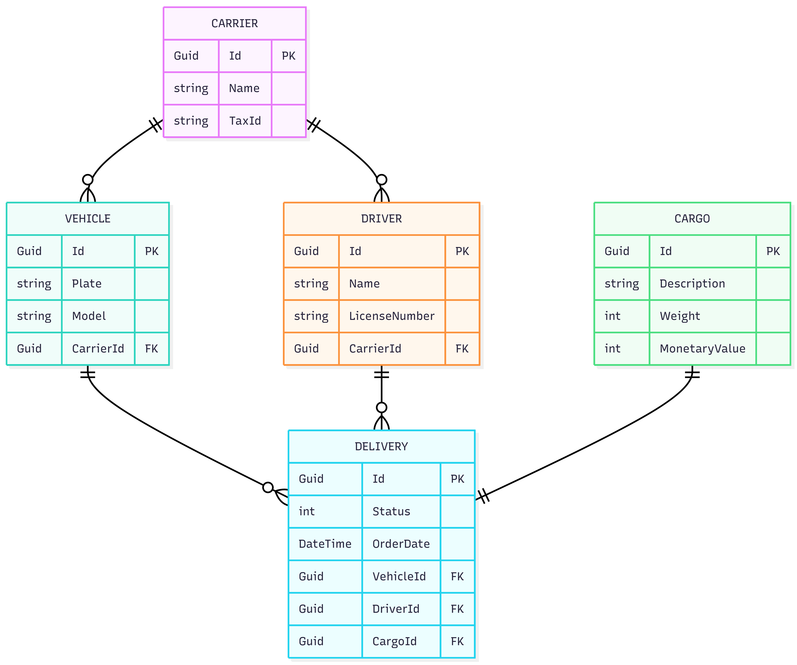
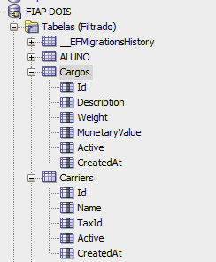
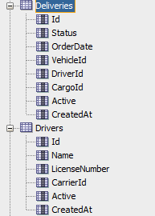
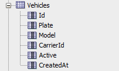
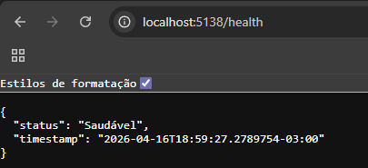
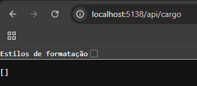

# 🚚 LogiTracker - Sistema de Gestão Logística

Este projeto faz parte da avaliação **CP2 (Check Point 2)** do curso de **Análise e Desenvolvimento de Sistemas - FIAP**.

O objetivo é aplicar conceitos de:

* Clean Architecture
* Entity Framework Core
* Mapeamento ORM (Fluent API)
* Persistência de dados com banco relacional
* Migrações versionadas

---

## 👥 Integrantes

* **Nome:** Felipe Monte de Sousa — **RM:** 562019
* **Nome:** Manuela de Lacerda Soares — **RM:** 564887

---

## 🏗️ Domínio Escolhido

O sistema **LogiTracker** atua no domínio de **Logística e Transportes**, permitindo:

* Gerenciamento de transportadoras
* Controle de veículos e motoristas
* Rastreamento de entregas
* Associação entre carga, veículo e motorista

---

## 🧩 Entidades Modeladas

O modelo foi implementado em C# seguindo princípios de encapsulamento e separação de responsabilidades:

* **Carrier (Transportadora):** entidade central que gerencia veículos e motoristas
* **Vehicle (Veículo):** representa os veículos da frota
* **Driver (Motorista):** profissionais vinculados à transportadora
* **Cargo (Carga):** informações da carga transportada
* **Delivery (Entrega):** operação logística que conecta veículo, motorista e carga

---

## 🔄 Relacionamentos (MER)

| Relacionamento     | Cardinalidade | Descrição                                   |
| ------------------ | ------------- | ------------------------------------------- |
| Carrier → Vehicle  | 1:N           | Uma transportadora possui vários veículos   |
| Carrier → Driver   | 1:N           | Uma transportadora possui vários motoristas |
| Vehicle → Delivery | 1:N           | Um veículo pode realizar várias entregas    |
| Driver → Delivery  | 1:N           | Um motorista pode realizar várias entregas  |
| Cargo → Delivery   | 1:1           | Uma carga gera exatamente uma entrega       |

## Modelo de Entidade-Relacionamento



📌 O modelo foi implementado fielmente no **Entity Framework Core**, incluindo:

* Chaves primárias (PK)
* Chaves estrangeiras (FK)
* Controle de nulidade
* Relacionamentos explícitos via Fluent API

---

## 🗄️ Banco de Dados

* **SGBD utilizado:** Oracle
* Configuração via **Entity Framework Core Provider para Oracle**

 , , 

### 📌 Justificativa

O Oracle foi escolhido por ser amplamente utilizado em ambientes corporativos e permitir explorar integrações robustas com o Entity Framework Core.

---

## ⚠️ Configuração do Banco (Importante)

Para executar o projeto, configure a string de conexão no arquivo `appsettings.json`:

```json
"ConnectionStrings": {
  "DefaultConnection": "User Id=SEU_USER;Password=SUA_SENHA;Data Source=SEU_ORACLE"
}
```

📌 **Importante:**

* Não versionar credenciais reais
* Recomenda-se uso de **User Secrets** ou variáveis de ambiente

---

## ⚙️ Persistência com EF Core

* `DbContext` localizado na camada **Infrastructure**
* Configuração via **Fluent API (`IEntityTypeConfiguration`)**
* Separação de mapeamento por entidade
* Relacionamentos explícitos e fiéis ao MER

---

## 🧬 Migrações

O projeto utiliza migrações versionadas do EF Core:

* Migration inicial criada

---

## ▶️ Como executar o projeto (Passo a passo)

1. Restaurar dependências:

```bash
dotnet restore
```

2. Compilar o projeto:

```bash
dotnet build
```

3. Aplicar migrações:

```bash
dotnet ef database update --project LogiTracker.Infrastructure --startup-project LogiTracker.API
```

4. Executar a API:

```bash
dotnet run --project LogiTracker.API
```

---

## 🧱 Arquitetura

O projeto segue o padrão **Clean Architecture**:

* **Domain:** Entidades e regras básicas
* **Application:** Interfaces de repositório
* **Infrastructure:** EF Core, DbContext e implementações
* **API:** Controllers e configuração de DI

---

## 🌐 Execução da API

### Endpoints disponíveis:

* `GET /health` → verifica se a API está online
* 

   
* `GET /api/cargo` → verifica os cargos disponiveis
*  
---

## 📁 Evidências

A pasta `/docs` contém:

* Print do banco de dados gerado
* Estrutura das tabelas
* Modelo MER atualizado
* Print dos Endpoints

---

## 🌟 Propósito

> “Faça o seu melhor, na condição que você tem, enquanto você não tem condições melhores, para fazer melhor ainda”
> — Mario Sergio Cortella

---

## 🔗 Relação com o CP1

| CP1              | CP2                      |
| ---------------- | ------------------------ |
| MER conceitual   | Esquema físico no banco  |
| Entidades em C#  | Persistência com EF Core |
| Sem banco        | Banco configurado        |
| Sem repositórios | Repositórios + DI        |

---
